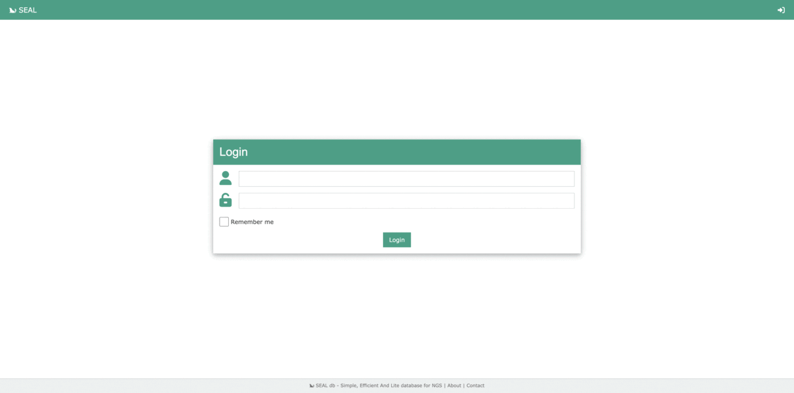

# SEAL db - Simple, Efficient And Lite database for NGS



SEAL db is a Python project that provides a simple, efficient, and lightweight
database for Next Generation Sequencing (NGS) data. SEAL db is built with the
Flask framework and uses PostgreSQL as the backend database. It includes a web
interface that allows users to upload and query NGS data.

__Please report any issue [here](https://github.com/mobidic/SEAL/issues/new)__

## Installation

To install SEAL db, first clone the repository from GitHub:

```bash
git clone https://github.com/mobidic/seal.git
```

SEAL db requires several dependencies to be installed, which can be done either
with Conda or manually.

### Install dependencies

#### With Conda

To install dependencies with Conda, first install Conda if it is not already installed. Conda installation instructions can be found ([here](https://docs.conda.io/projects/conda/en/latest/user-guide/install/index.html))

After installing Conda, create a new environment using the environment.yml file
provided with SEAL db:

`conda env create -f environment.yml`

#### Installing VEP

> __If you have install all dependencies from conda you need to activate your
environment by launching this command:__ `conda activate seal`

After installing dependencies, you need to install VEP (Variant Effect
Predictor), which is used by SEAL db to annotate variants. The installation
instructions for VEP can be found
[here](https://www.ensembl.org/info/docs/tools/vep/script/vep_download.html#installer).

For conda environment:

`vep_install -a cf -s homo_sapiens -y GRCh37 -c /output/path/to/GRCh37/vep --CONVERT`

##### Plugins & Customs

*__A more complete guide will be written soon__*

After installing VEP, you need to install several VEP plugins :
> The installation instructions for VEP plugins can be found ([here](https://www.ensembl.org/info/docs/tools/vep/script/vep_plugins.html)).

<details>
  <summary><b>dbNSFP (plugins)</b></summary>

```bash
version=4.8c
wget https://dbnsfp.s3.amazonaws.com/dbNSFP${version}.zip /PATH/dbNSFP${version}.zip
unzip dbNSFP${version}.zip
zcat dbNSFP${version}_variant.chr1.gz | head -n1 > h
zgrep -h -v ^#chr dbNSFP${version}_variant.chr* | sort -k1,1 -k2,2n - | cat h - | bgzip -c > dbNSFP${version}_grch38.gz
tabix -s 1 -b 2 -e 2 dbNSFP${version}_grch38.gz
zgrep -h -v ^#chr dbNSFP${version}_variant.chr* | awk '$8 != "." ' | sort -k8,8 -k9,9n - | cat h - | bgzip -c > dbNSFP${version}_grch37.gz
tabix -s 8 -b 9 -e 9 dbNSFP${version}_grch37.gz
```

</details>

<details>
  <summary><b>dbscSNV (plugins)</b></summary>

```bash
wget https://usf.box.com/shared/static/ffwlywsat3q5ijypvunno3rg6steqfs8 /PATH/dbscSNV1.1.zip
unzip dbscSNV1.1.zip
head -n1 dbscSNV1.1.chr1 > h
cat dbscSNV1.1.chr* | grep -v ^chr | sort -k5,5 -k6,6n | cat h - | awk '$5 != "."' | bgzip -c > dbscSNV1.1_GRCh38.txt.gz
tabix -s 5 -b 6 -e 6 -c c dbscSNV1.1_GRCh38.txt.gz
cat dbscSNV1.1.chr* | grep -v ^chr | cat h - | bgzip -c > dbscSNV1.1_GRCh37.txt.gz
tabix -s 1 -b 2 -e 2 -c c dbscSNV1.1_GRCh37.txt.gz
```

</details>

<details>
  <summary><b>MaxEntScan (plugins)</b></summary>

```bash
wget "http://hollywood.mit.edu/burgelab/maxent/download/fordownload.tar.gz" -O /PATH/maxent
tar -zxvf /PATH/maxent/fordownload.tar.gz
```

</details>

<details>
  <summary><b>SpliceAI (plugins)</b></summary>

Edit output path if needed (for example to write it into a conda env).
You need to have a basespace account.

```bash
wget "https://launch.basespace.illumina.com/CLI/latest/amd64-linux/bs" -O $HOME/bin/bs
chmod u+x $HOME/bin/bs
bs authenticate
bs download dataset -i ds.20a701bc58ab45b59de2576db79ac8d0 --exclude "*" --include "spliceai_scores.masked.snv.hg38.vcf.gz" --include "spliceai_scores.masked.indel.hg38.vcf.gz" --include "spliceai_scores.masked.snv.hg38.vcf.gz.tbi" --include "spliceai_scores.masked.indel.hg38.vcf.gz.tbi" -o /PATH/SpliceAI/
```

</details>

<details>
  <summary><b>GnomAD (custom)</b></summary>

```bash
dn="/PATH/gnomad/v4.1/";
gsutil -m cp -r   "gs://gcp-public-data--gnomad/release/4.1/vcf/joint" ${dn}
for i in $(ls ${dn}/joint/*.vcf.bgz); do
    bn=$(basename $i);
    chr=${bn:24:-8};
    echo "$bn";
    bcftools view -e "INFO/AC_joint=0" ${i} | bcftools annotate -x "^INFO/AF_joint,INFO/AF_joint_XX,INFO/AF_joint_XY,INFO/AF_joint_afr,INFO/AF_joint_ami,INFO/AF_joint_amr,INFO/AF_joint_asj,INFO/AF_joint_eas,INFO/AF_joint_fin,INFO/AF_joint_mid,INFO/AF_joint_nfe,INFO/AF_joint_raw,INFO/AF_joint_remaining,INFO/AF_joint_sas,INFO/AF_grpmax_joint,INFO/AF_exomes,INFO/AF_genomes,INFO/nhomalt_joint" -O z6 -o ${dn}/light/gnomad.v4.1.${chr}.vcf.gz -;
    tabix ${dn}/light/gnomad.v4.1.${chr}.vcf.gz
done
bcftools concat ${dn}/light/gnomad.v4.1.chr*.vcf.gz -O z6 -o ${dn}/light/gnomad.v4.1.vcf.gz
tabix ${dn}/light/gnomad.v4.1.vcf.gz
printf "INFO/AF_joint AF\nINFO/AF_joint_afr AF_AFR\nINFO/AF_joint_amr AF_AMR\nINFO/AF_joint_asj AF_ASJ\nINFO/AF_joint_eas AF_EAS\nINFO/AF_joint_fin AF_FIN\nINFO/AF_joint_nfe AF_NFE\nINFO/AF_joint_remaining AF_OTH\n" > ${dn}/light/rename
bcftools annotate --rename-annots ${dn}/light/rename  ${dn}/light/gnomad.v4.1.vcf.gz -O z6 -o ${dn}/light/gnomad.v4.1.rename.vcf.gz -W
bcftools sort -O z6 -o ${dn}/light/gnomad.v4.1.rename.sort.vcf.gz -W ${dn}/light/gnomad.v4.1.rename.vcf.gz
```

</details>

<details>
  <summary><b>Clinvar (custom)</b></summary>

```bash
wget https://ftp.ncbi.nlm.nih.gov/pub/clinvar/vcf_GRCh37/clinvar.vcf.gz /PATH/clinvarGRCh37/
wget https://ftp.ncbi.nlm.nih.gov/pub/clinvar/vcf_GRCh38/clinvar.vcf.gz /PATH/clinvarGRCh38/
tabix /PATH/clinvarGRCh37/clinvar.vcf.gz
tabix /PATH/clinvarGRCh38/clinvar.vcf.gz
```

</details>

### Configuration

After installing dependencies and VEP, you need to configure the app by editing
two files:
- `seal/static/vep.config.json`
- `seal/config.yaml`

In `seal/static/vep.config.json`, replace the following variables with the appropriate paths:
- `{dir_vep}` => `/path/to/vep`
- `{dir_vep_plugins}` => `/path/to/vep/plugins`
- `{GnomAD_vcf}` => `/path/to/gnomad.vcf`
- `{fasta}` => `/path/to/genome.fa.gz`

In `seal/config.yaml`, create your secret app key and edit other settings as
needed.

### Initialization of the database

> If you install all dependencies with conda make sure to activate the
> environment :
> ```bash
> conda activate seal
> ```

> comment line on `seal/__init__.py` (see [#26](https://github.com/mobidic/SEAL/issues/26))
> ```python
> # from seal import routes
> # from seal import schedulers
> # from seal import admin
> ```

To initialise the database, start the database server and run the following
commands:

```bash
initdb -D ${PWD}/seal/seal.db
pg_ctl -D ${PWD}/seal/seal.db -l ${PWD}/seal/seal.db.log start
psql postgres -c "CREATE DATABASE seal;"
python insertdb.py -p password
```

> uncomment line on `seal/__init__.py` (see [#26](https://github.com/mobidic/SEAL/issues/26))
> ```python
> from seal import routes
> from seal import schedulers
> from seal import admin
> ```

```bash
flask --app seal --debug db init
flask --app seal --debug db migrate -m "Init DataBase"
```

The database will be intialise with an admin user :
- username : `admin`
- password : `password`

Optionally, you can also add gene regions and OMIM data to the database.

```bash
wget -qO- http://hgdownload.cse.ucsc.edu/goldenpath/hg19/database/ncbiRefSeq.txt.gz   | gunzip -c - | awk -v OFS="\t" '{ if (!match($13, /.*-[0-9]+/)) { print $3, $5-2000, $6+2000, $13; } }' -  | sort -u > ncbiRefSeq.hg19.sorted.bed
python insert_genes.py
```
```bash
wget -qO- https://data.omim.org/downloads/{{YOUR API KEY}}/genemap2.txt
python insert_OMIM.py
```

### Launching the App

Finally, to launch the app, run the following command:
```bash
flask --app seal --debug run
```

## Tips & Tricks

Here are some useful *Tips & Tricks* working with SEAL:

- Update database
```bash
flask --app seal --debug db migrate -m "message"
flask --app seal --debug db upgrade
```

- Start/Stop the datatabase server
```bash
pg_ctl -D ${PWD}/seal/seal.db -l ${PWD}/seal/seal.db.log start
pg_ctl -D ${PWD}/seal/seal.db -l ${PWD}/seal/seal.db.log stop
```

- Dump/Restore the database
```bash
pg_dump -O -C --if-exists --clean --inserts -d seal -x -F t -f seal.tar
pg_restore -x -f seal.tar
```
- Edit date of history manually
```bash
# connect to database
psql -d seal -W
seal=# UPDATE history SET date='2023-12-04 12:31:22.163852' WHERE "user_ID"=4 AND "sample_ID"=256 AND date='2023-10-15 05:05:23.191648';
```

- Multiple instances of SEAL (maybe usefull for differents projects, teams, tests, stages...)

*Edit the config.yaml*
```yaml
  SQLALCHEMY_DATABASE_URI: 'postgresql:///seal-bis'
```
*Follow the [initialization steps](#initialization-of-the-database) with this new database (edit this ommand)*
```bash
psql postgres -c "CREATE DATABASE seal-bis;"
```


# License

GNU General Public License v3.0 or later

See [COPYING](COPYING) to see the full text.
